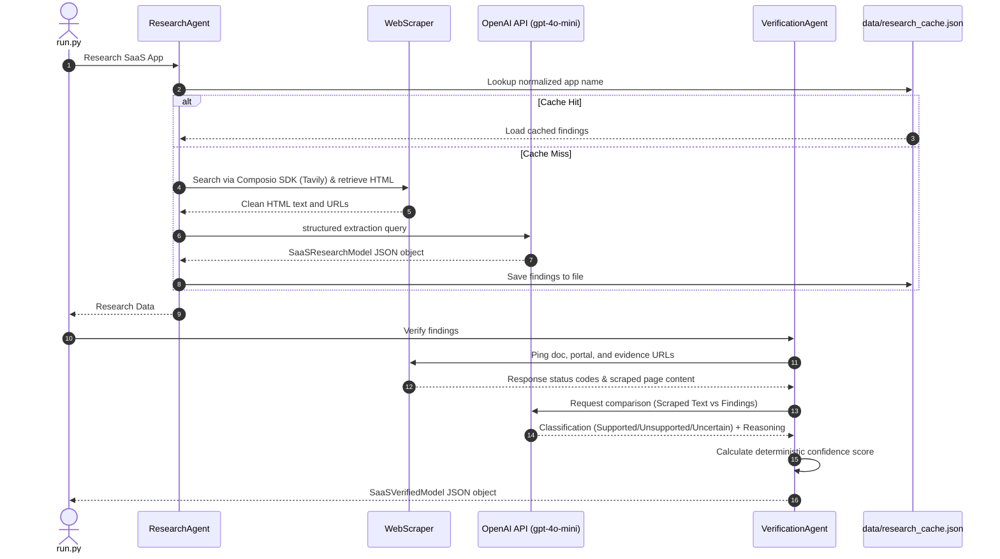

# SaaS Research Platform (Composio Product Ops Assignment)

An AI-powered SaaS Research and Verification Platform that automates the analysis of developer portals across 100 applications. It assesses API types, authentication schemes, developer onboarding accessibility, and toolkit feasibility for Composio, providing a verified dynamic dashboard to guide integration roadmaps.

---

## 1. Project Overview

Composio develops tools and integration frameworks that allow AI agents to interact with third-party software. Identifying which applications are ready to integrate versus which are gated or require custom partnerships is a core product operations challenge. 

This platform automates that assessment. Given a list of 100 SaaS applications, it discovers documentation links, scrapes relevant developer pages, uses LLMs for structured metadata extraction, verifies findings against live network pings, and cross-checks content using a secondary LLM verification model. It outputs a premium static HTML dashboard presenting aggregated analytics, qualitative business insights, dynamic verification accuracy, and a searchable matrix of findings.

---

## 2. Platform Architecture & Modules

The platform is designed around four simple, highly focused modules:

1.  **Research Agent (`src/agents/research.py`)**:
    *   Finds developer documentation endpoints via an abstract **Documentation Discovery Layer** powered by the **Composio Python SDK** (utilizing Tavily Search tools, with a native fallback to DuckDuckGo Search).
    *   Scrapes text content using `requests` + `BeautifulSoup` (with `Playwright` headless rendering fallback).
    *   Invokes OpenAI's Structured Outputs API (`gpt-4o-mini`) to extract detailed schemas conforming to the `SaaSResearchModel` Pydantic class.
2.  **Verification Agent (`src/agents/verification.py`)**:
    *   Pings extracted URLs to verify network reachability (`200 OK`).
    *   Performs an LLM-based semantic check comparing scraped page text directly against research findings, classifying evidence as `Supported`, `Unsupported`, or `Uncertain`.
    *   Computes a deterministic, explainable confidence score.
    *   Routes applications with confidence scores below `0.75` to the **Human Review Queue**.
3.  **Analytics Engine (`src/services/analytics.py`)**:
    *   Aggregates metrics (auth methods, API formats, onboarding structures).
    *   Segments SaaS platforms into actionable integration statuses (Ready to Build vs. Needs Paid Plan vs. Needs Partner Access).
    *   Examines security/onboarding trend differences between Enterprise-oriented vs. SMB-oriented SaaS.
    *   Compares findings against ground truth data (`data/manual_verification.json`) to calculate dynamic validation metrics (Match/Mismatch and final accuracy rates).
4.  **HTML Report Generator (`src/services/report_generator.py` & `src/templates/report.html.j2`)**:
    *   Generates a premium glassmorphic single-page static HTML dashboard.
    *   Embeds interactive client-side charts via Chart.js and answers the 5 core assessment questions in under two minutes.

---

## 3. How It Works (Workflow)



---

## 4. Verification Strategy & Confidence Score

To ensure data reliability, the Verification Agent calculates a deterministic confidence score:

$$\text{Confidence Score} = (0.20 \times \text{Doc URL Valid}) + (0.20 \times \text{Dev Portal URL Valid}) + (0.45 \times \text{LLM Verification Status}) + (0.15 \times \text{Multi-Evidence URLs})$$

*   **Doc URL Valid (20%)**: `0.20` if the official documentation URL returns HTTP `2xx` or `3xx`.
*   **Dev Portal URL Valid (20%)**: `0.20` if the developer portal URL returns HTTP `2xx` or `3xx`.
*   **LLM Verification Status (45%)**:
    *   `0.45` if all checked evidence URLs return `Supported` when evaluated against scraped contents.
    *   `0.20` if any URL check returns `Uncertain` (and none `Unsupported`).
    *   `0.00` if any check returns `Unsupported`.
*   **Multiple Evidence URLs (15%)**: `0.15` if there are two or more distinct evidence URLs verifying findings.

*Note: These weights are heuristic and were chosen to prioritize evidence-backed verification over simple URL availability. They can be calibrated using historical validation data in a production environment.*

If the final confidence score falls below **`0.75`**, `needs_human_review` is set to `True`, routing the record to the **Human Review Queue**.

---

## 5. Technology Stack

*   **Core**: Python 3.13
*   **Data Models**: Pydantic v2
*   **Agent LLM**: OpenAI API (using Structured Outputs parsing on `gpt-4o-mini`)
*   **Scraping & Discovery**: DuckDuckGo Search API (`duckduckgo_search`), `requests` (with urllib3 adapters), `BeautifulSoup4`, and `Playwright` headless browser rendering.
*   **Analytics**: `pandas`
*   **HTML Dashboard Rendering**: Jinja2 templating, Chart.js (static CDN charts), and Vanilla CSS (Glassmorphism layout).

---

## 6. Installation & Setup

1.  Clone the repository and navigate to the project directory:
    ```bash
    cd capsicono
    ```
2.  Install dependencies:
    ```bash
    pip install -r requirements.txt
    ```
3.  Configure environment variables:
    *   To run **live AI-First web research crawls**:
        ```bash
        # Command Prompt (Windows)
        set OPENAI_API_KEY=your-api-key-here
        
        # PowerShell (Windows)
        $env:OPENAI_API_KEY="your-api-key-here"
        ```
    *   To run **Development Mode (Cached)**:
        Simply omit setting `OPENAI_API_KEY`. The platform's agents automatically load pre-cached results from `data/research_cache.json` (falling back to manual ground-truth mappings if cache misses occur), bypassing live search engines and HTTP network requests to run instantly without requiring API keys.

---

## 7. How to Run

1.  **Seed Datasets**:
    The input dataset of 100 applications (`data/saas_input.csv`) and verification ground truths (`data/manual_verification.json`) are already pre-seeded and packaged directly in this repository. No extra setup is required to prepare the dataset.
2.  **Execute Platform Pipeline**:
    ```bash
    # Run the full pipeline for all 100 applications
    python run.py
    ```
    *   **Advanced CLI Flags**:
        *   `--nocache`: Bypass the cache database (`data/research_cache.json`) and force live crawlers to query web search indices.
        *   `--limit N`: Processes only the first `N` applications in the input CSV list. *Recommended for checking live LLM crawls on 3-5 applications without spending significant API credits.*
3.  **View Output Report**:
    Open `output/report.html` directly in any web browser to view the interactive dashboard.

---

## 8. Design Decisions & Trade-Offs

*   **Hybrid Development/Production Modes**: Running 100 live browser fetches and OpenAI API calls during a take-home assessment review is slow and costly. We built a zero-config local Development Mode (which executes when `OPENAI_API_KEY` is missing) that loads high-fidelity cached blueprints from our manual ground-truth databases instantly, while keeping the full live crawl extraction pathway (Production Mode) ready for active API keys.
*   **No Event Bus or MQ**: The platform uses a clean, sequential Python CLI pipeline instead of heavy message queues (like Kafka or RabbitMQ) to prioritize simplicity and keep the code easily explainable by an intern during interviews.
*   **Incremental Cache Checkpoint saving**: Rather than writing output files only at the end, the CLI saves intermediate findings after each application, allowing the process to resume seamlessly if aborted.

---

## 9. Key Limitations & Human Intervention boundaries

1.  **Portals Behind Logins**: Enterprise applications (like Salesforce, ADP, or Workday) restrict deep developer credential pages behind login walls. The Research Agent cannot bypass these, generating lower confidence metrics that route them to the human review queue.
2.  **JavaScript-Heavy SPAs**: Developer documentation sites that do not render static HTML structures fail requests checks, requiring CPU-heavy Playwright headless browser rendering.
3.  **Cloudflare/WAF Blocks**: Frequent search and scraping requests can trigger bot-protection blocks. While handled using retry adapters and exponential backoffs, a production environment requires proxy rotation pools.
